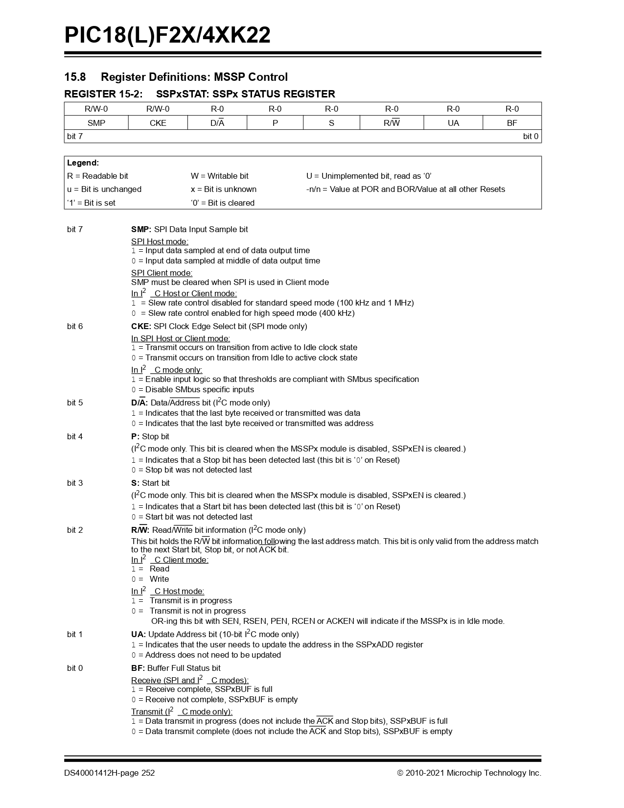

# Proyecto final

## Integrantes

 Juan David Bernal Bernal

## Nombre del proyecto: 
 
  Contador de cabinas

## Documentación
 
 ## Introduccion
   
   Crearemos un sistema basado en radiofrecuencia para enviar un dato desde la cabina donde sea recepcionado al paso de cada estación procesandolo a una base de datos cuyo propósito será llevar a detalle los ciclos de trabajo para generar un plan de mantenimiento más detallado optimizando la gestión de repuestos, permitiendo tener control sobre la predicción de fallas.

 ## Nuestra necesidad 

  Contamos con un sistema de transporte excepcional lo cual implica llevar el control de ciclos por cabina para programar sus rutinas de mantenimiento y rediseñar el plan de mantenimiento de acuerdo al registro real.

 ## Como se realiza actualmete?

 Se realiza de manera teórica y se estima de acuerdo a las horas de operación programadas, su cálculo se realiza de acuerdo al promedio de ciclos que complete al cabo de hacer un recorrido completo por las cuatro estaciones y en cada uno se cuentan 12 ciclos, una cabina por dia en 18 horas se estima que realiza un aproximado de 52 ciclos por dia, y el registro se lleva ha llevado de esta forma.

 ## Configuracio inicial

 Se usará el módulo transreceptor LoRa SX1278 junto con el microcontrolador PIC18F45K22 mediante la comunicación sincrónica usando el protocolo SPI (Serial Peripheral Interface) cuya particularidad de configuración se ajusta para el receptor y emisor, la detección del paso a través de una entrada o salida de estación, se tomará de acuerdo a un patrón de dispositivos magnéticos que permitan reconocer una secuencia en software que realizara una secuencia y direccionara la información a el modulo receptor más cercano, allí este dato mediante una raspberry se convertirá en una base formada a través de SQL que permitirá indexar cada uno de los registros en una base de excel.

 ## Objetivo general
 Desarrollar un sistema basado en radiofrecuencia que registre con precisión los ciclos de trabajo de las cabinas en cada estación para optimizar la planificación del mantenimiento, mejorar la gestión de repuestos y permitir la predicción de fallas.

  ## Objetivos específicos

 - Técnicos y de Implementación:

    - Diseñar e implementar un sistema de detección mediante dispositivos magnéticos que identifiquen       inequívocamente el paso de cada cabina por las estaciones.
    - Configure la comunicación SPI entre el microcontrolador PIC18F45K22 y el módulo transreceptor LoRa SX1278.
    - Desarrollar el software necesario para procesar la secuencia de detección y transmitir los datos al receptor más cercano.
    - Implementar una base de datos SQL en Raspberry Pi que almacene eficientemente todos los registros de ciclos.
    - Lograr Crear una interfaz de exportación a Excel para facilitar el análisis y la gestión de los datos.

 - Operativos y de Gestión:

    - Sustituir el sistema actual de estimación teórica por un registro preciso y automatizado de ciclos reales.
    - Reduzcir el margen de error en el conteo de ciclos a menos del 1%.
    - Establecer un sistema de alertas para cuando las cabinas se aproximan a umbrales críticos de ciclos que requieren mantenimiento.
    - Garantizar el funcionamiento continuo del sistema durante las 18 horas diarias de operación por cada cabina en circulacion.

 - Estratégicos:

   - Rediseñar el plan de mantenimiento basado en datos reales de uso, optimizando los intervalos de servicio.
   - Implementar un modelo predictivo de fallas basado en patrones históricos de ciclos y eventos.
   - Reducir los tiempos de inactividad por mantenimiento correctivo en al menos un 30%.
   - Optimizar el inventario de repuestos según los datos reales de desgaste y ciclos de trabajo.
   - Aumentar la vida útil de los componentes críticos mediante mantenimiento preventivo oportuno.

 - Económicos:

  - Reducir los costos de mantenimiento correctivo en un 25% durante el primer año.
  - Optimizar el inventario de repuestos, reduciendo el capital inmovilizado en al menos un 15%.
  - Lograr un retorno de inversión del proyecto en un plazo máximo de 2 años mediante la reducción de costos operativos.

 - Documentación y Medición:

  - Implementar un sistema de informes automáticos (base de datos), que muestren claves métricas como ciclos por cabina, por estación y por período.
  - Desarrollar un tablero que permita visualizar en tiempo real el estado de las cabinas y su proximidad a ciclos de mantenimiento.
  - Documentar completamente el sistema para facilitar su mantenimiento y posibles actualizaciones futuras.

  ## Justificacion

  Este proyecto de sistema de monitoreo de ciclos mediante radiofrecuencia se justifica por la necesidad crítica de transitar desde un modelo de mantenimiento basado en estimaciones teóricas hacia uno fundamentado en datos reales y precisos.
  Actualmente, el mantenimiento de las cabinas se planifica con base en cálculos aproximados (52 ciclos diarios estimados), lo que genera incertidumbre en la programación de las intervenciones y puede resultar en dos escenarios igualmente problemáticos: mantenimiento prematuro, que desperdicia recursos y genera paradas innecesarias, o mantenimiento tardío, que aumenta el riesgo de fallas imprevistas y costosas.
  La implementación de este sistema automatizado permitirá:

  - Optimización de recursos : El registro exacto de ciclos reducirá significativamente los costos de mantenimiento correctivo y la gestión de inventarios de repuestos.
  - Aumento de disponibilidad : La predicción precisa de fallas minimizará los tiempos de inactividad no programados, maximizando la disponibilidad del sistema de transporte.
  - Extensión de vida útil : Un mantenimiento basado en el uso real de los componentes prolongará su vida útil, retrasando inversiones en reposición.
  - Mejora continua : Los datos históricos recopilados permitirán perfeccionar constantemente los planes de mantenimiento, adaptándolos a las condiciones reales de operación.
  - Toma de decisiones informada : La administración de mantenimiento contará con información precisa para planificar presupuestos, recursos humanos y materiales necesarios para el mantenimiento.
  
  ## Que es un ciclo de cabina 
   
  Es la apertura y desembrague de una cabina en la estacion dejando de sujetarse del cable tractor donde la misma se sujeta y alli transita mediante sistemas de traccion prpios de la estacion y el control sobre el movimiento de la cabina se da por llantas que friccionan el vehiculo y lo desplazan a lo largo de la pista de transito.

  A continuacion se mostrara como se realiza un ciclo por cabina

   [ciclo de cabina](./Ciclo.mp4)

  ##  Investigacion
 
   Para nuestro desarrollo ya que al momento de implementarse no se debeia afectar la estructura propia en la instalaciones de la plataforma electromecanica como de las cabinas el sistema de conteo por cabinas se debe realizar mediante un sensor de deteccion magnetico de tipo magnetico que conmuta en presencia de un campo magnetico de modo que al acercarse a una zona donde un iman se podra sensar el paso de una cabina realizando un ciclo en la estacion.
   Con ello este este impulso detecta se lleva al microcontrolador de modo que su trasmicion se enviara mediante el LoRa SX1278 cuya tarea es enviar el paquete de datos direcionado de modo que datara el numero de cabina, este paso se lleva a cabo mediante la comunicacion SPI (Serial Peripheral Interface), que permitira inicializar el modulo de comucacion, configurar los modos de operacion (baudrate, sleep, entre otros), enviar la trama de registros para cada una de las operaciones cuando se detecta, espor eso que nuestro mayor reto ha sido entablar este procotolo de comunicacion lo cual estara veremos con detenimiento:

  ## Aspectos Generales

  El protocolo SPI (Serial Peripheral Interface) es un estándar de comunicación síncrona serial ampliamente utilizado en sistemas embebidos para interconectar microcontroladores con periféricos digitales. Sus características fundamentales incluyen:

  - Comunicación full-duplex : Permite transmisión y recepción simultánea de datos.
  - Arquitectura maestro-esclavo : Un dispositivo maestro controla la comunicación con uno o múltiples esclavos.
  - Interfaz de 4 hilos :

     - MOSI (Master Out Slave In): Línea para datos del maestro al esclavo
     - MISO (Master In Slave Out): Línea para datos del esclavo al maestro
     - SCK (Serial Clock): Señal de reloj generada por el maestro
     - NSS/CS (Slave Select/Chip Select): Señal para seleccionar el dispositivo esclavo

  - Configuración flexible : mediante los parámetros CPOL (polaridad del reloj) y CPHA (fase del reloj), que determinan el modo de operación (0-3).
  - Velocidades elevadas : Permite tasas de transferencia significativamente superiores a otros protocolos como I²C o UART.

  ## Ventajas del SPI en Aplicaciones de Radiofrecuencia
   La implementación del protocolo SPI en sistemas de monitoreo por radiofrecuencia ofrece ventajas significativas debido a sus características intrínsecas. La naturaleza de alta velocidad del SPI permite la adquisición y procesamiento de datos en tiempo real, aspecto crítico en aplicaciones donde se requiere analizar señales RF con precisión. Con tasas de transferencia que pueden alcanzar varios MHz, el SPI facilita la comunicación eficiente entre los microcontroladores y componentes RF como sintetizadores de frecuencia, amplificadores digitalmente controlados y convertidores analógico-digitales de alta velocidad.
   La comunicación full-duplex del SPI resulta particularmente valiosa en sistemas de monitoreo RF donde es necesario transmitir comandos de configuración mientras simultáneamente se reciben datos de medición. Esta capacidad reduce la latencia del sistema y mejora la eficiencia operativa, permitiendo ajustes dinámicos de parámetros como frecuencia, ganancia o ancho de banda sin interrumpir el proceso de adquisición de datos.

  ## Consideraciones de Implementación para Sistemas RF
   En el diseño de sistemas de monitoreo por radiofrecuencia basados ​​en SPI, deben considerar aspectos críticos como la integridad de la señal y el manejo de interferencias. La proximidad de componentes RF de alta potencia puede introducir ruido en las líneas de comunicación SPI, por lo que es recomendable implementar técnicas de aislamiento y blindaje adecuadas. Las líneas de transmisión deben diseñarse con impedancias controladas y longitudes minimizadas para reducir los efectos de reflexión y degradación de señal.
   La selección del modo SPI apropiado (CPOL/CPHA) debe realizarse considerando las especificaciones de los componentes RF específicos utilizados en el sistema. Muchos dispositivos RF modernos, como los transceptores digitales y analizadores de espectro integrados, especifican modos SPI particulares para su correcta operación. Además, la frecuencia del reloj SCK debe seleccionarse cuidadosamente para equilibrar la velocidad de transferencia con la estabilidad del sistema, especialmente en entornos con alta exposición a radiofrecuencia.
     
 ## Aplicacion comunicacion SPI en el proyecto

   En nuestro proyecto de monitoreo de ciclos para cabinas, la implementación SPI opera específicamente en Modo 0 (CPOL=0, CPHA=0), donde el reloj permanece en estado bajo durante inactividad y los datos se muestrean en los flancos ascendentes, configuración óptima para el módulo SX1278. La señal de reloj SCK se genera a una frecuencia conservadora de 250 kHz (derivada de Fosc/64 con el oscilador principal a 16MHz), equilibrando velocidad y estabilidad para garantizar comunicaciones confiables en entornos industriales con potencial ruido electromagnético. Esta implementación SPI gestiona meticulosamente los tiempos críticos de configuración (5μs antes de iniciar transferencias) y espera (5μs al finalizar), esenciales para la sincronización precisa con el SX1278. Los pines RC3 (SCK), RC4 (MISO), RC5 (MOSI) y RA5 (CS) del PIC18F45K22 se dedican exclusivamente a esta interfaz, mientras el sistema implementa verificaciones de integridad que aseguran transferencias exitosas mediante lecturas/escrituras de prueba a registros específicos como el REG_VERSION (0x42). Esta robusta arquitectura de comunicación permite transmitir confiablemente los datos capturados por los sensores Reed hacia el módulo LoRa, que posteriormente los propaga a la estación receptora más cercana, formando así el núcleo operativo de nuestro sistema de monitoreo automatizado.

     
    Imagen.1 Transaccion registro de reconocimiento de chip SX1278 Ra-01

  
   ## Como funciona el codigo para hacer posible la comunicacion?

   Mediante los pines propios definidos por defecto del fabricante y haciendo uso de el periferico MSSP1 para los pines mencionados con ello sus registros de configuracion desde el datasheet y lograr configurar a travez del hardware del microcontrolador cada una de las lineas tal que la comunicacion SPI sea transmitida usando la arquitectura del PIC, de la siguiente manera estara configurado:

   Para el registro seleccionamos los puertos de la siguiente manera usando los registros propios:
    
   - TRISCbits.TRISC3 = 0     SCK como salida
   - TRISCbits.TRISC4 = 1     SDI (MISO) como entrada
   - TRISCbits.TRISC5 = 0     SDO (MOSI) como salida
   
   Para el registro que toma inicialmente alli tendremos a (Synchronous Serial Port 1) (Puerto serie síncrono 1) "SSP1" configura el puerto 

     
    Imagen.2 Registro de configuracion SSP1TAT tomado del datasheet.
   
   Esta implementacion en el proyecto esta configurada con el valor 0x40 (binario: 01000000) el registro SSP1STAT (Synchronous Serial Port 1 Status register) alli especificado tenemos para sus configuraciones:
   
   - (Bit 7) Bit de control de fase de muestreo, SMP = 0,El muestreo ocurre en la mitad del tiempo de bit alli garantiza que los datos se lean cuando son más estables proporcionando suficiente tiempo de setup para que el dispositivo esclavo presente los datos correctos reduciendo errores de comunicación a distancias más largas o con señales menos ideales
   - (Bit 6) Bit de control de borde de reloj, SCK = 1, alli define en qué transición del reloj ocurre la transmisión de datos en especifico Los datos se transmiten en la transición del reloj de activo a inactivo (flanco descendente cuando CKP=0).
   - (Bit 5-1) Estos bit estan desabilitados deshabilitados ya que son netamente configuracion para el protocolo I2C, para el protocolo SPI se toman sin uso. 
   - (Bit 0) Indica si el buffer de recepción está lleno, BF = 0, Este bit es de solo lectura y se establece automáticamente por hardware. El valor 0 aquí simplemente inicializa el registro, pero no afecta al bit BF.

   Nuestro siguiente registro poe desglozar es el registro SSP1CON1 (Synchronous Serial Port 1 Control 1) para cada uno de los bits de configuracion, en el codigo podemos ver que SSP1CON1 toma el valor 0x02 (en binario 00000010) vamos a justificarlo:

   - (Bit 7) Detecta colisiones de escritura en el buffer de transmisión SPI (Write COLlision) (Colision de Escritura) WCOL = 0, su valor se establece para inicializar este bit como limpio, indicando que no hay colisión de escritura.
   - (Bit 6) este Indica que se recibió un nuevo byte cuando el buffer aún contenía datos previos no leídos (Synchronous Serial Port OVerflow) (Desbormaniento Puerto Serial Sincrono) SSPOV = 0, para nuestro codigo se configura, luego se activa en (1) cuando los datos recibidos se pierden por no leer SSP1BUF a tiempo.
   - (Bit 5) Habilita o deshabilita todo el módulo SSP, SSPEN = 0 (Synchronous Serial Port ENable) (habilitar Puerto Serial Sincrono) inicialmente lo configuramos de estamanera ya que aqui lo necesitamos deshabilitado porque se podrían generar pulsos de reloj y datos inválidos durante la configuración.
   - (Bit 4) Determina la polaridad del reloj en estado de reposo ,CKP =0 (ClocK Polarity) (Polaridad de reloj) Definiendo el nivel lógico del reloj cuando está inactivo entre transmisiones cuando es 0 el reloj en reposo está en nivel bajo (CPOL=0), luego Cuando es 1 el reloj en reposo está en nivel alto (CPOL=1) 
   - (Bit 3-0)  Selecciona el modo de operación del módulo SSP y la velocidad de SCK nuestro reloj para cada transaccion SPI, SSPM = 0010 (Synchronous Serial Port Mode) (Modo del Puerto Serie Síncrono), con ello logramos el modo 0 como lo exige el datasheet del LoRa y alli nuestra frecuencia de oscilador se divide entre 64, de modo que la velocidad del reloj SPI sera igual a FOSC/64, 16MHz/64 = 250KHz 

     
    Imagen.3 Registro de configuracion SSP1CON1 tomado del datasheet.

     
    Imagen.4 Registro de configuracion SSP1CON1 tomado del datasheet.

   Una vez teniendo claro estas configuraciones para cada uno de los registros podemos explicar cada registro especifico donde de manera individual nos dara configuraciones temporales o definitivas en la funcion de inicializacion SPI por Hardware "initSPIHardware" que no devuelve ningun valor y por lo tanto ningun parametro, como los es el caso para deshabilitar el modulo antes de iniciar su configuracion, SSP1CON1bits.SSPEN = 0 este registro es tomado de SSP1CON1 para su bit 5 SSPEN.
   En la siguiente linea declaramos una variable temporal con caracteristicas sin signo, para valores enteros numericos, tamaño de 8 bits y de tipo defino (_t) y se encargara de asignar el valor actual contenido en el registro SSP1BUF que es el buffer de datos del modulo SPI al leer este registro se elimina cualquier dato residual que pudiera estar en el buffer:

      SSP1CON1bits.SSPEN = 0;    
      uint8_t dummy = SSP1BUF;  
  
   Para SSP1STAT y SSP1CON1 previamente configurados ahora si procedemos a habilitar al el modulo SPI con el registro especifico situado en SSP1CON en el bit 5 SSPEN = 1 o como se especifica la ruta propia en el codigo SSP1CON1bits.SSPEN = 1 , luego manipulamos el bit 3 SSP1IF (Host Synchronous Serial Port 1 Interrupt Flag) del registro PIR1 (Peripheral Interrupt Request Flag Register 1) alli establecemos la limpieza de la bandera de interrupcion SPI asegurando que no hayan interrupciones SPI pendientes antes de iniciar nuevas comunicaciones para lo que se establece automáticamente (1) cuando una transmisión/recepción SPI se completa.
   Esta línea complementa la limpieza inicial del buffer (dummy = SSP1BUF) para garantizar que tanto el buffer de datos como las banderas de estado del SPI estén en un estado inicial apropiado antes de cualquier comunicación.

     SSP1CON1bits.SSPEN = 1;     Habilitar el módulo SPI
     PIR1bits.SSP1IF = 0;        Limpiar flag de interrupción
     dummy = SSP1BUF;            Limpiar cualquier dato pendiente

     
    Imagen.4 Registro de configuracion SSP1IF tomado del datasheet.

   Desde los registros consecuentes de la configuracion del microcontrolador PIC18F45K22 podemos concliur los detalles relevantes de el protocolo de comunicacion para escuchar y leer sobre el modulo LoRa SX1278 Ra-01 en los puertos designados, nuestra configuracion se ajusta a usar la arquitectura desde el hardware explicitamente del periferico SPI.

   Luego tendremos a la funcio reset Module aparte de ser genuinamente un reinicio da al modulo un Wakeup o despertarse de modo que lo preparara para realizar alguna transaccion se vale precizar que este accion se ejecuta al pin de NSS y MOSI responde ya que Como no se llama a spiTransfer() durante estos pulsos, no hay datos específicos siendo enviados.

    Reset completo del módulo SX1278
    
    void resetModule(void) {
    SPI_RESET = 0;              Activar reset
    __delay_ms(10);
    SPI_RESET = 1;              Desactivar reset
    __delay_ms(10);
    
     Ciclos de CS para despertar el módulo
     for(uint8_t i = 0; i < 3; i++) {
        SPI_NSS = 0;
        __delay_ms(1);
        SPI_NSS = 1;
        __delay_ms(1);
     }
    
     __delay_ms(10);
   } 

   Alli el pin RESET se activa y se desactiva de manera manual por software permitiendo un control preciso sobre el proceso de reinicio del dispositivo LoRa luego para despertar en un ciclo for declaramos un contador que inia en 0 se posiciona e itera hasta lograr compararse con el valor maximo que se establecio como 3 es alli que hace posible cambiar de estado a NSS con retardos de 1 milisegundo por cada cambio de estado activado como es propia la configuracion de este pin en cada flanco de descenso.
   
     
    Imagen.5 Tecnica "Despertar modulo" alistar para iniciar transacciones.

   Para la funcion de transferencia tomara valor el tipo de comunicacion ya que este es tipo full-duplex cuyo proposito es transmitir un entero numerico sin singno de 8 bits por SPI y simultáneamente recibe un entero numerico sin singno de 8 bits del dispositivo esclavo, esto consiste en hacer bidireccional los datos por cada byte que envíamos, simultáneamente recibimos otro byte.
   En nuestro codigo La función spiTransfer establece un canal de comunicación bidireccional SPI donde uint8_t data define el byte que enviaremos al dispositivo externo, mientras que el tipo de retorno uint8_t indica que la función devolverá exactamente un byte como resultado de la operación. La variable local uint8_t receivedcrea un espacio temporal dedicado para almacenar este dato recibido, que posteriormente será retornado al código que llamó a la función  

     

    

   
## Diagramas

  
    Diagrama.1 Test de comunicacion al iniciar modulo LoRa.

  
    Diagrama.2 Funcion de transferencia de datos full-duplex SPI.

## Conclusiones

<!-- Crear una carpeta src e incluir en ella los códigos y/o el proyecto de mplab-->
